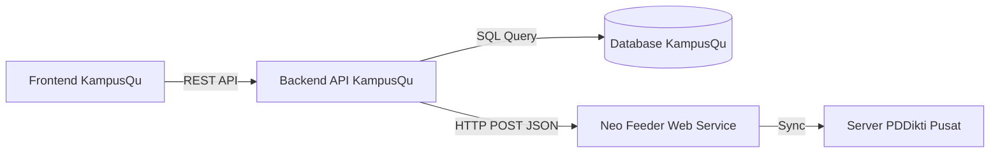

# Panduan Teknis Integrasi KampusQu dengan PDDikti Neo Feeder

Dokumen ini berisi spesifikasi teknis, arsitektur, dan panduan implementasi untuk menghubungkan aplikasi **KampusQu Ecosystem** dengan aplikasi pelaporan pemerintah **PDDikti Neo Feeder**.

---

## 1. Arsitektur Sistem

Integrasi dilakukan menggunakan konsep **Middleware**. Aplikasi Frontend (React) tidak boleh terhubung langsung ke Feeder demi keamanan dan performa.

### Diagram Alur Data


### Komponen yang Dibutuhkan
1.  **Server Neo Feeder**: Komputer/Server di kampus yang terinstall aplikasi PDDikti Neo Feeder (disediakan Kemdikbud).
2.  **Backend Service**: Aplikasi penghubung (Node.js/Laravel/Go/Python) yang bertugas menerjemahkan data KampusQu ke format Feeder.
3.  **Database SQL**: Migrasi dari `database.json` ke MySQL/PostgreSQL wajib dilakukan untuk menyimpan UUID.

---

## 2. Analisis Kebutuhan Data (Gap Analysis)

Agar data dari KampusQu bisa diterima oleh PDDikti, format data harus disesuaikan. Berikut adalah perbandingan data saat ini dengan standar PDDikti.

### A. Tabel Mahasiswa
| Field KampusQu | Status | Syarat PDDikti | Tindakan Diperlukan |
| :--- | :--- | :--- | :--- |
| `id` | **Internal** | Tidak dipakai. Feeder butuh UUID. | Tambah kolom `feeder_id` (UUID) |
| `nama` | Oke | Sesuai KTP/Ijazah | Validasi input nama tanpa gelar |
| `ibu_kandung` | **Missing** | **WAJIB** untuk validasi NIK | Tambah field di database |
| `nik` | **Missing** | Wajib 16 digit angka | Tambah field & validasi panjang |
| `tanggal_lahir` | **Missing** | Format `YYYY-MM-DD` | Tambah field |
| `periode` | Oke | Kode 5 digit (misal: 20241) | Konversi "Ganjil 2024" ke "20241" |

### B. Tabel Mata Kuliah & Nilai
| Field KampusQu | Status | Syarat PDDikti | Tindakan Diperlukan |
| :--- | :--- | :--- | :--- |
| `nama_mk` | Oke | Sesuai Kurikulum | - |
| `sks` | Oke | Angka (1-6) | - |
| `nilai_huruf` | Oke | A, B, C, D, E | - |
| `nilai_indeks` | **Missing** | 4.00, 3.00, dst | Tambah konversi otomatis Huruf ke Angka |

---

## 3. Strategi Implementasi: "Jalan Dulu, Integrasi Nanti"

Untuk mempercepat pengembangan aplikasi tanpa terhambat aturan PDDikti yang kaku, gunakan strategi **Shadow ID**.

### Konsep Shadow ID
Jangan gunakan UUID PDDikti sebagai *Primary Key* di aplikasi Anda. Tetap gunakan ID sederhana (Auto Increment atau string unik) untuk kecepatan aplikasi.

1.  **Di Database Lokal (`database.json` / SQL):**
    Tambahkan satu kolom bernama `feeder_id` atau `id_pd` pada tabel utama (Mahasiswa, Dosen, MK, Kelas). Biarkan `NULL` saat data baru dibuat di aplikasi.

    ```json
    // Contoh Data Mahasiswa di database.json
    {
      "id": "MHS-001",          // ID Lokal (Cepat & Mudah)
      "feeder_id": null,        // Placeholder untuk UUID PDDikti (Diisi nanti)
      "nama": "Budi Santoso",
      "nim": "2024001"
    }
    ```

2.  **Mekanisme Sinkronisasi (Nanti):**
    Buat skrip *background job* yang berjalan setiap malam atau saat tombol "Sync" ditekan:
    *   Ambil data yang `feeder_id`-nya masih `NULL`.
    *   Kirim ke Feeder (`InsertBiodataMahasiswa`).
    *   Ambil balasan UUID dari Feeder.
    *   Update `feeder_id` di database lokal dengan UUID tersebut.

### Keuntungan
*   **UI/UX Cepat:** Aplikasi tidak perlu menunggu respon server Feeder yang lambat saat user mendaftar.
*   **Fleksibel:** Anda bisa mengubah logika aplikasi tanpa takut merusak data Feeder.
*   **Aman:** Jika server Feeder mati, aplikasi KampusQu tetap berjalan normal.

---

## 4. Spesifikasi Web Service Feeder

Aplikasi Neo Feeder menyediakan antarmuka Web Service (WS) yang berjalan secara lokal di server kampus.

*   **Endpoint Utama**: `http://[IP_SERVER_FEEDER]:8100/ws/live2.php`
*   **Protokol**: HTTP POST JSON

### Contoh Payload Request
```json
{
  "act": "NamaFungsi",
  "token": "TokenAuthorisasi",
  "filter": "KriteriaPencarian", 
  "limit": 100,
  "offset": 0
}
```

---

## 5. Contoh Kode Mapping (Node.js)

Berikut logika sederhana untuk sinkronisasi data menggunakan strategi Shadow ID.

```typescript
// Fungsi Sync Mahasiswa
async function syncMahasiswaToFeeder(localStudent) {
  // 1. Cek apakah sudah ada di Feeder (Punya UUID?)
  if (localStudent.feeder_id) {
     console.log("Data sudah tersinkronisasi.");
     return;
  }

  // 2. Mapping Data Lokal ke Format Feeder
  const feederPayload = {
    nama_mahasiswa: localStudent.nama,
    jenis_kelamin: localStudent.gender === 'Laki-laki' ? 'L' : 'P',
    tempat_lahir: localStudent.tempat_lahir,
    tanggal_lahir: localStudent.tgl_lahir, // Format YYYY-MM-DD
    nik: localStudent.nik,
    nama_ibu_kandung: localStudent.ibu_kandung // Wajib!
  };

  // 3. Kirim ke Feeder
  try {
    const token = await getToken(); // Fungsi login feeder
    const response = await axios.post(FEEDER_URL, {
       act: 'InsertBiodataMahasiswa',
       token: token,
       record: feederPayload
    });

    // 4. Simpan UUID balasan ke Database Lokal (Shadow ID)
    if (response.data.error_code === 0) {
       const newUUID = response.data.data.id_mahasiswa;
       await updateLocalDatabase(localStudent.id, { feeder_id: newUUID });
       console.log("Sukses Sync! UUID:", newUUID);
    }
  } catch (err) {
    console.error("Gagal Sync:", err);
  }
}
```
